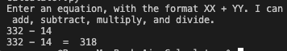
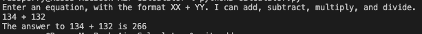
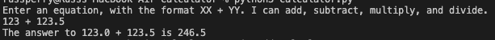
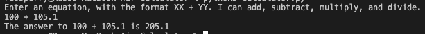

# Python Calculator
This is a simple calculator that I am making as part of my #100DaysOfCode challenge specifically with Python. I since I am still getting familiar with Python, I wanted to do a project that was relatively simple, and one that I didn't have to watch a tutorial for.

You can find what I am working on in my #100DaysOfPython over at my Twitter, [found here](https://twitter.com/russintech/status/1687943560409038848?s=20).

## To-do List
- ~~Make the input section it's own function.~~
- ~~Add ability to use floats.~~

## Implemented Features
### Phase 1
  
- The program takes an input in a simple format (XX + YY), and can spit out the answer.
- Currently accepts +, -, *, and / as operators.
- Currently only works with integers, but will spit out decimals for unequal division. 

### Phase 2
  
- Refactored the code so that the portion of asking for input, and formatting the input so that it's a callable function.
- Reworded the answer phrase so it makes a little more sense to be read.

### Phase 3
  
- Allows the users to enter decimal numbers.
    - I am aware that floats are not entirely accurate. This is just a fun calculator project, okay? It's not something someone will actually use!

### Phase 4
  
- Made a function that would get rid of the trailing .0 on a float that was a whole number.
- Makes the answer look a little cleaner.
